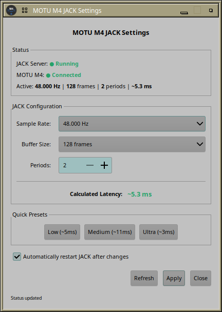

# MOTU M4 JACK Automation System for Ubuntu Studio

Automatic JACK audio server management for the MOTU M4 USB audio interface. Starts and stops JACK based on hardware detection and user login status.


## Features

- **Automatic JACK start/stop** when MOTU M4 is connected/disconnected
- **Hot-plug support** - connect M4 anytime, JACK starts automatically
- **Boot detection** - JACK starts after login if M4 is already connected
- **GTK3 GUI** for easy setting selection
- **3 latency profiles** - Low (5.3ms), Medium (10.7ms), Ultra-Low (1.3ms)
- **Passwordless operation** via polkit for audio group members

## Quick Start

```bash
# 1. Clone the repository
git clone https://github.com/giang17/motu-m4-jack-starter.git
cd motu-m4-jack-starter

# 2. Run the installer (installs everything)
sudo ./install.sh

# 3. Configure JACK setting (optional - default is Setting 1)
sudo motu-m4-jack-setting-system.sh 2 --restart
```

The installer automatically sets up all scripts, UDEV rules, GUI, polkit rules, and systemd services.

For manual installation, see [INSTALL.md](INSTALL.md).

## JACK Settings

| Setting | Sample Rate | Buffer | Latency | Use Case |
|---------|-------------|--------|---------|----------|
| 1 - Low | 48 kHz | 3×256 | ~5.3 ms | General audio work |
| 2 - Medium | 48 kHz | 2×512 | ~10.7 ms | Stable, recommended |
| 3 - Ultra-Low | 48 kHz | 3×128 | ~2.7 ms | Optimized systems only |

## GUI

Start the GUI via terminal or application menu:

```bash
motu-m4-jack-gui.py
```

Or find it in: **Audio/Video → MOTU M4 JACK Settings**



## Documentation

See [INSTALL.md](INSTALL.md) for:
- Detailed installation instructions
- Configuration options
- Troubleshooting guide
- Technical details

## Requirements

- Ubuntu Studio 24.04+
- MOTU M4 USB Audio Interface
- Pipewire with JACK compatibility
- Python 3 + GTK3 (for GUI)

## License

GPL-3.0-or-later - See [LICENSE](LICENSE)

---

**Status**: Production Ready ✅